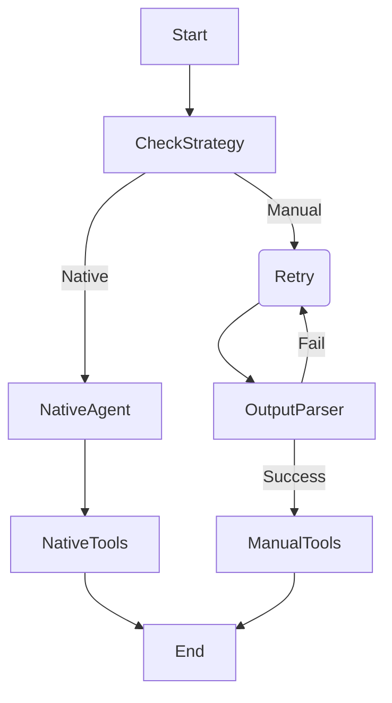

# 设计 - 通用 Tool Calling 调试框架与容错解析

## 1. 背景 (Background)
为了评估不同能力层级的模型（从顶级商业模型到本地小参数模型）的工具调用能力，我们需要在 `General Chat` Tab 中构建一个灵活的调试环境。该环境需支持动态开启/关闭工具，并针对不同模型采用差异化的 Prompt 注入与结果解析策略。

## 2. 需求分析 (Requirements)
1.  **UI 交互**: 在 Model Config 面板增加工具开关（File IO, JS Eval），移除性能统计。
2.  **多模态适配**: 
    - 强模型（GPT-4/Claude 3.5）：使用 Native Tool Calling。
    - 弱模型/特定模型（DeepSeek R1/Local Llama）：可能需要 XML 标记或特定的 Prompt 引导，且输出可能不符合标准 JSON 格式。
3.  **新增工具**:
    - `vfs_*`: 复用已有的 VFS 工具。
    - `browser_js_eval`: 执行 JavaScript 代码片段（用于测试逻辑计算或简单的 DOM 操作）。

## 3. 架构设计

### 3.1 前端状态管理 (`lib/store.ts` & `ModelConfig`)
扩展 Zustand Store 以存储工具开启状态：
```typescript
interface ModelStore {
  // ... existing
  enabledTools: {
    file_io: boolean; // vfs_read/write/list
    js_eval: boolean; // browser_js_eval
  };
  toggleTool: (key: keyof ModelStore['enabledTools']) => void;
}
```
通过 `StudioShell` 将 `enabledTools` 注入到 `runtime` 和 `transport` 中，使后端感知当前启用的工具集合。

### 3.2 工具定义 (`lib/tools/`)
新增 `browser_js_eval` 工具定义。

- **Schema**:
  ```typescript
  { code: string }
  ```
- **Implementation (Client)**:
  使用 `new Function()` 或 `eval` 执行代码，并捕获 `console.log` 和返回值。

### 3.3 后端上下文管理与解析策略 (`assistants/general-chat/`)

这是本设计的核心。为了适应不同模型，我们将引入 **`ToolStrategy` (工具策略模式)**。

#### A. 策略定义
在 `lib/model.ts` 或 `assistants/utils` 中定义策略接口：

1.  **Native Strategy (默认)**:
    - **Prompt**: 标准 System Prompt。
    - **Injection**: 使用 `model.bind_tools(tools)`。
    - **Parsing**: 依赖 LangChain 标准输出解析。

2.  **Prompt-Engineering Strategy (弱模型/R1模式)**:
    - **Prompt**: 注入详细的工具描述和调用格式说明（如 "Use XML format: `<tool_call>...`"）。
    - **Injection**: 不使用 `.bind_tools`，而是将 Schema 作为文本拼接到 User Message 或 System Message 中。
    - **Parsing**: 使用正则（Regex）或模糊解析器（Fuzzy Parser）从文本中提取工具调用指令，并手动构造 `ToolMessage`。

#### B. 容错解析器 (`RobustToolParser`)
针对弱模型经常出现的错误（如 JSON 格式错误、Markdown 代码块包裹 JSON、字段缺失），设计一个中间件 Node：
1.  **Pre-processing**: 移除 Markdown 包裹符 (````json ... ````)。
2.  **Repair**: 尝试使用 `json5` 或类似库修复松散的 JSON。
3.  **Fallback**: 如果解析失败，返回给模型一个 System Message："Error parsing tool call. Please ensure strict JSON format." 让其重试。

### 3.4 Graph 流程调整
`General Chat` 的 Graph 将演变为：


*(注：为了简化 MVP，初期可以将 OutputParser 逻辑内嵌在 Model 调用后的处理步骤中)*

## 4. 实施计划 (TODO)

### Phase 1: 前端改造
- [ ] **Store**: 更新 `lib/store.ts` 增加 `enabledTools`。
- [ ] **UI**: 修改 `ModelConfig`，增加 Checkbox，删除 Performance Stats。
- [ ] **Shell**: 将配置透传给 Backend。

### Phase 2: JS Tool 实现
- [ ] **Tool Def**: 创建 `lib/tools/js-tools.ts`。
- [ ] **Impl**: 在 `StudioShell` 中实现 JS 执行逻辑。

### Phase 3: 后端策略引擎
- [ ] **Strategies**: 定义 `ToolStrategy` 接口及 `Native` 实现。
- [ ] **Integration**: 修改 `assistants/general-chat/graph.ts`，根据 `enabledTools` 动态加载工具，并应用基础策略（暂时全走 Native，后续迭代 Manual 策略）。

## 5. 关键代码片段预演

**Browser JS Eval Implementation:**
```typescript
const browser_js_eval = async ({ code }: { code: string }) => {
  const logs: string[] = [];
  const originalConsoleLog = console.log;
  console.log = (...args) => logs.push(args.join(' '));
  
  try {
    const result = new Function(code)();
    return JSON.stringify({ 
      result, 
      logs 
    });
  } catch (e) {
    return `Error: ${e.message}`;
  } finally {
    console.log = originalConsoleLog;
  }
}
```
