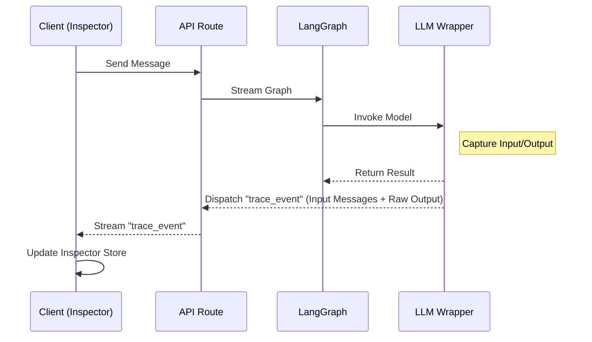

# 设计 - 通用原始上下文查看器 (Raw Context Inspector)

## 1. 背景 (Background)
为了深度调试模型行为，特别是 Tool Calling 的格式对齐和 System Prompt 的注入效果，开发者需要查看“LLM 真正接收和输出的原始 Token”。现有的 UI 仅展示处理后的对话，无法满足这一需求。本设计旨在实现一个通用的中间件，将底层交互数据透传至前端并可视化。

## 2. 架构设计 (Architecture)

### 2.1 数据流向


### 2.2 后端实现 (Server Side)

#### A. `TraceData` 结构
定义标准的 Trace 数据结构，确保前后端解析一致。
```typescript
// lib/tools/trace-types.ts
export interface TraceLog {
  id: string; // Unique trace ID
  node: string; // Graph node name (e.g., "agent", "coder")
  timestamp: number;
  inputs: any[]; // Serialized LangChain messages (what LLM received)
  output: any;   // Serialized AIMessage (what LLM returned)
}
```

#### B. `WrappedModel` (Model Middleware)
创建一个工具函数 `traceable`，用于包裹 `createChatModel` 返回的模型实例或直接包裹 Node 函数。
*   它不改变原有逻辑，只是在执行前后捕获数据。
*   利用 LangChain 的 `RunnableConfig` 或 LangGraph 的 `dispatchCustomEvent` (如果支持) 发送数据。
*   **注意**: 由于 Next.js 环境限制，我们可能需要利用 `streamMode: "custom"` 或将 Trace 数据混入 chunk metadata。
*   **更简单的方案**: 直接在 Node 内部调用 `dispatchCustomEvent` (LangGraph v0.2+ feature)。

### 2.3 前端实现 (Client Side)

#### A. `TraceStore` (Zustand)
独立于 `model-store`，专门存储当前会话的 Trace Logs。
*   `logs: TraceLog[]`
*   `addLog(log)`
*   `clearLogs()`

#### B. `ContextInspector` 组件 (`components/debug/context-inspector.tsx`)
*   **UI**: 一个 `Sheet` (侧边抽屉)，点击 Header 上的 "Code" 图标触发。
*   **Content**: 使用 `JSONTree` 或简单的 `<pre>` 展示 `inputs` 和 `output`。
*   **Integration**: 提供一个 `InspectorTrigger` 按钮，可放置在 `StudioShell` 或 `Thread` Header 中。

#### C. Runtime Adapter
我们需要在 `AssistantChatTransport` 或 `useChatRuntime` 的层级拦截后端推回来的 Custom Events，并调用 `TraceStore.addLog`。

## 3. 实施计划 (TODO)

### Phase 1: Shared Types & Store
- [ ] **Types**: 创建 `lib/debug/types.ts` 定义 `TraceLog`。
- [ ] **Store**: 创建 `lib/debug/store.ts`。

### Phase 2: Backend Tracing
- [ ] **Helper**: 创建 `lib/debug/server-trace.ts`，提供 `emitTrace` 函数（基于 LangGraph `dispatchCustomEvent` 或直接 yield custom chunk）。
- [ ] **Integration**: 改造 `assistants/general-chat/graph.ts`，在 `callModel` 中调用 `emitTrace`。

### Phase 3: Frontend UI
- [ ] **Component**: 开发 `components/debug/context-inspector.tsx`。
- [ ] **Trigger**: 将 Trigger 按钮集成到 `StudioShell` 的 Chat Header 中。
- [ ] **Transport Hook**: 修改 `app/api/chat` 的流处理逻辑，确保 Trace 数据能到达前端 Store。

## 4. 关键技术点：Custom Event Transmission

在 LangGraph + AI SDK 的流式响应中传输自定义数据：
1.  **Server**: 使用 `StreamData` (from `ai` package) 或在 `toUIMessageStream` 之外单独处理 custom events。
2.  **Protocol**: 可以在流中插入特殊标记的 Chunk，或者利用 `X-Trace-Data` header (仅限一次性数据，不适合流)。
3.  **Decision**: 使用 `ai` SDK 的 `StreamData` 是最标准的做法。在 `app/api/chat/route.ts` 中，我们将创建一个 `StreamData` 实例，并在 LangGraph 产生 custom event 时将其 `append` 到 data 流中。

