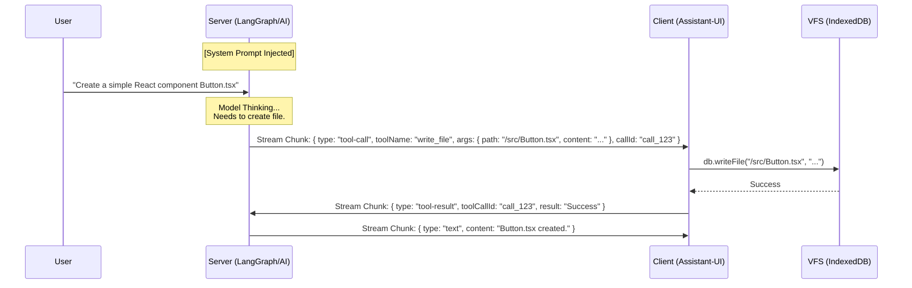
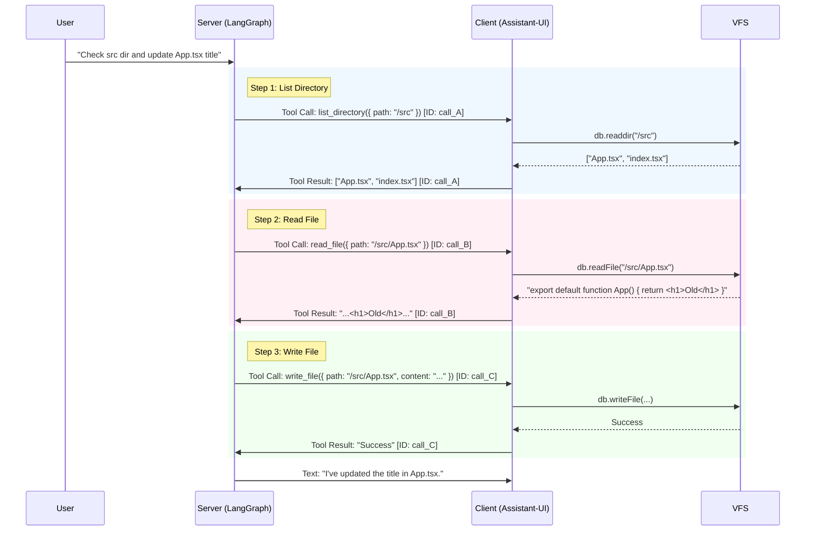

# 2026-02-07-21-29-设计-工具定义与上下文拼接策略

## 1. 背景与目标

我们需要为 `ling-open-studio` 实现两组核心能力工具集：
1.  **Browser JS Eval**: 允许模型在用户的浏览器环境中执行 JavaScript 代码并获取结果。
2.  **Virtual File System (VFS)**: 允许模型对浏览器端的虚拟文件系统进行增删改查。

挑战在于模型能力的多样性（如 GPT-4o 支持原生 Tool Calling，而一些开源模型或推理模型可能需要通过 Prompt 引导）。我们需要一种策略来动态适配这些模型。

## 2. 工具定义 (Tool Definitions)

我们将使用 Zod Schema 进行严格定义，这不仅用于 AI SDK 的 `tool()` 定义，也用于生成 System Prompt 中的类型描述。

### 2.1 Toolset: Browser Execution (`browser_js`)

该工具允许模型进行计算、DOM 操作或数据处理。

```typescript
import { z } from "zod";

export const browserJsTools = {
  browser_js_eval: {
    description: "Execute JavaScript code in the user's browser environment. Use this for calculations, data processing, or accessing browser APIs. Returns the result of the last expression or console logs.",
    parameters: z.object({
      code: z.string().describe("The JavaScript code to execute. e.g. '2 + 2' or 'window.innerWidth'"),
    }),
  },
};
```

### 2.2 Toolset: File System (`vfs`)

该工具集是对虚拟文件系统的 CRUD 操作。

```typescript
import { z } from "zod";

export const vfsTools = {
  list_directory: {
    description: "List files and directories at a specific path in the virtual file system. Always list before reading to ensure paths exist.",
    parameters: z.object({
      path: z.string().default("/").describe("The directory path to list. Defaults to root '/'."),
    }),
  },
  read_file: {
    description: "Read the text content of a file from the virtual file system.",
    parameters: z.object({
      path: z.string().describe("The absolute path of the file to read."),
    }),
  },
  write_file: {
    description: "Write text content to a file in the virtual file system. Creates parent directories if they don't exist.",
    parameters: z.object({
      path: z.string().describe("The absolute path of the file to write."),
      content: z.string().describe("The text content to write into the file."),
    }),
  },
};
```

## 3. 上下文拼接策略 (Context Splicing Strategy)

为了确保在所有模型（包括推理模型如 DeepSeek R1，或原生 Tool Calling 能力较弱的模型）上获得一致的工具使用行为，我们将 **全量采用 "Prompt-Reinforced" (提示词强化) 范式**。

这意味着：我们不依赖模型的原生 `bind_tools` 魔法，而是通过 System Prompt 将工具视为一种显式的“协议”进行注入和约束。

### 3.1 核心范式：协议化工具调用

我们将工具定义为模型必须遵循的特殊指令格式。System Prompt 将包含以下三个核心部分：

1.  **Capability Declaration (能力声明)**: 告知模型它拥有操作浏览器和文件系统的权限。
2.  **Strict Tool Schema (严格模式定义)**: 以伪代码或 JSON Schema 的形式，在 Prompt 中清晰展示每个工具的名称、参数和预期返回。
3.  **Mental Model & Constraints (心智模型与约束)**: 定义模型在调用工具前后的思考逻辑（例如：读文件前必须先列目录）。

### 3.2 Prompt 拼接逻辑 (Prompt Splicing)

针对每个 Toolset，我们将强制注入对应的 **Context Fragment**。

#### A. Fragment for `browser_js` (浏览器执行协议)

```markdown
### TOOL_PROTOCOL: Browser Execution
You can execute JavaScript in the user's browser.
- TOOL: `browser_js_eval(code: string)`
- EXECUTION_ENVIRONMENT: Standard browser window context. Access to `window`, `document`.
- OUTPUT: Returns the evaluation result or console output.
- STRATEGY: Use this for complex logic, math, or DOM inspection.
```

#### B. Fragment for `vfs` (虚拟文件系统协议)

```markdown
### TOOL_PROTOCOL: Virtual File System
You have read/write access to a persistent Virtual File System (VFS).
- TOOLS:
  1. `list_directory(path: string)` -> Returns string[]
  2. `read_file(path: string)` -> Returns file content
  3. `write_file(path: string, content: string)` -> Returns "Success" or Error
- OPERATIONAL_GUIDELINES:
  - **Directory Discovery**: You MUST call `list_directory` before attempting to read a file you haven't seen in the current session.
  - **Atomic Writes**: `write_file` overwrites the target file. You must provide the full new content.
  - **Pathing**: Use absolute paths starting with `/`.
```

### 3.3 推理模型适配 (Reasoning Model Adaptation)

对于推理模型（如 DeepSeek R1），我们在 Prompt 中会特别强调：
"In your <thought> process, you should first plan which tools to call. Then, output the tool call in the standard format outside the thought block."

## 4. Assistant-UI Call-Result 循环机制

`assistant-ui` 通过一种标准化的 **Tool Calling Loop (工具调用循环)** 来处理客户端工具执行。其核心理念是：**AI 产生意图 -> UI 拦截并执行 -> UI 返回结果 -> AI 继续生成**。

1.  **AI (Server)**: 在流式响应中输出一个特殊的 `tool-call` 数据块。
2.  **Runtime (Client)**: `assistant-ui` 监听流，检测到 `tool-call` 时暂停生成，匹配本地注册的工具实现。
3.  **Executor (Client)**: 执行实际的副作用（如 `eval(js)`, `db.write(file)`）并返回 `result`。
4.  **Result Feedback (Client -> Server)**: Runtime 将 `tool-result` 发回服务器，服务器根据结果继续生成。

## 5. 场景时序图与上下文流转 (Scenario Lifecycle)

### 场景 2: 项目初始化 (VFS Write)



### 场景 3: 探索性修改 (List -> Read -> Write)



## 6. 上下文快照 (Prompt-Reinforced Format)

在 **场景 3 的第 2 步 (Read File) 之前**，模型看到的完整对话历史快照：

```markdown
=== SYSTEM ===
### TOOL_PROTOCOL: Virtual File System
... (Tool schemas) ...
- OPERATIONAL_GUIDELINES:
  - **Directory Discovery**: You MUST call `list_directory` before attempting to read a file...

=== USER ===
看看 src 目录下有什么，帮我把 App.tsx 的标题改一下。

=== ASSISTANT ===
{
  "tool_calls": [
    {
      "id": "call_A",
      "type": "function",
      "function": {
        "name": "list_directory",
        "arguments": "{\"path\": \"/src\"}"
      }
    }
  ]
}

=== TOOL (call_A) ===
["App.tsx", "index.tsx"]
```


## 4. 客户端-服务端协同架构

由于 Agent 运行在服务端（LangGraph），而工具执行在客户端（Browser），我们需要利用 `assistant-ui` 的 `Call`/`Result` 循环。

1.  **Server**: 模型输出 Tool Call (e.g., `list_directory("/")`)。
2.  **Protocol**: Server 将 Tool Call 序列化流式传输给 Client。
3.  **Client**: 
    *   `Runtime` 拦截到 Tool Call。
    *   匹配本地注册的 Tool Implementation (`client-side tools`)。
    *   执行 JS 或 IndexedDB 操作。
    *   将结果 (`ToolResult`) 发回 Server。
4.  **Server**: 收到 ToolResult，恢复 Graph 执行。

## 5. 预期场景模拟 (Scenarios)

### 场景 1: 简单计算 (JS Eval)
- **User**: "计算 1000 以内的所有素数之和。"
- **Model**: 判断这是一个计算任务，不应消耗 token 手算。
- **Action**: Call `browser_js_eval({ code: "..." })`.
- **Client**: 执行 JS，返回 `76127`.
- **Model**: "结果是 76127。"

### 场景 2: 项目初始化 (VFS Write)
- **User**: "帮我创建一个简单的 React 组件 `Button.tsx`。"
- **Model**: 意识到需要写文件。
- **Context Check**: 根据 VFS Prompt，知道可以直接写。
- **Action**: Call `write_file({ path: "/src/Button.tsx", content: "..." })`.
- **Client**: 写入 IndexedDB，返回 "Success".
- **Model**: "组件已创建，路径为 /src/Button.tsx。"

### 场景 3: 探索性修改 (VFS List -> Read -> Write)
- **User**: "看看 src 目录下有什么，帮我把 App.tsx 的标题改一下。"
- **Model**: 遵循 VFS Workflow。
- **Action 1**: Call `list_directory({ path: "/src" })`.
- **Client Result**: `["App.tsx", "index.tsx"]`.
- **Action 2**: Call `read_file({ path: "/src/App.tsx" })`.
- **Client Result**: `"...<h1>Old Title</h1>..."`.
- **Action 3**: Call `write_file({ path: "/src/App.tsx", content: "...<h1>New Title</h1>..." })`.
