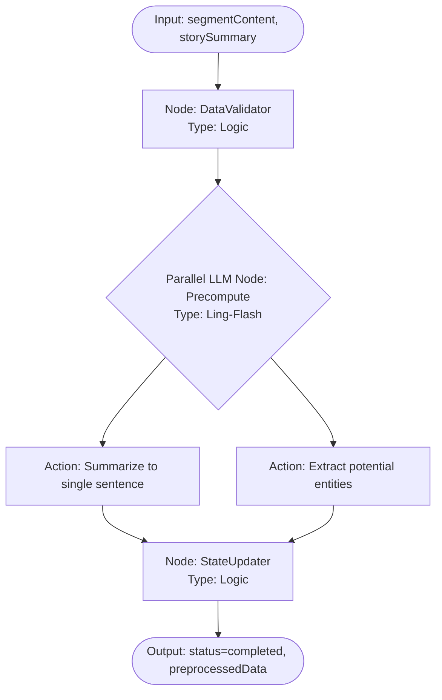
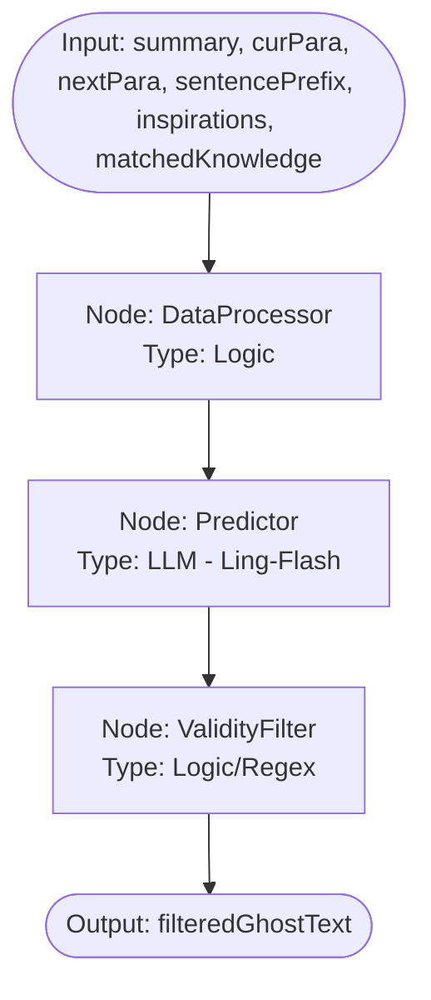
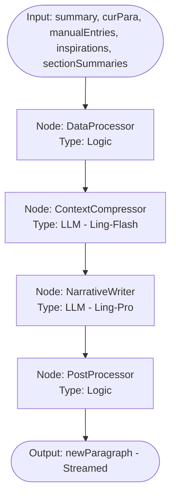
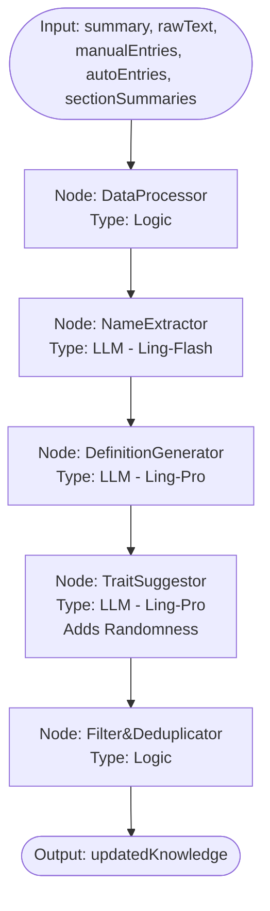
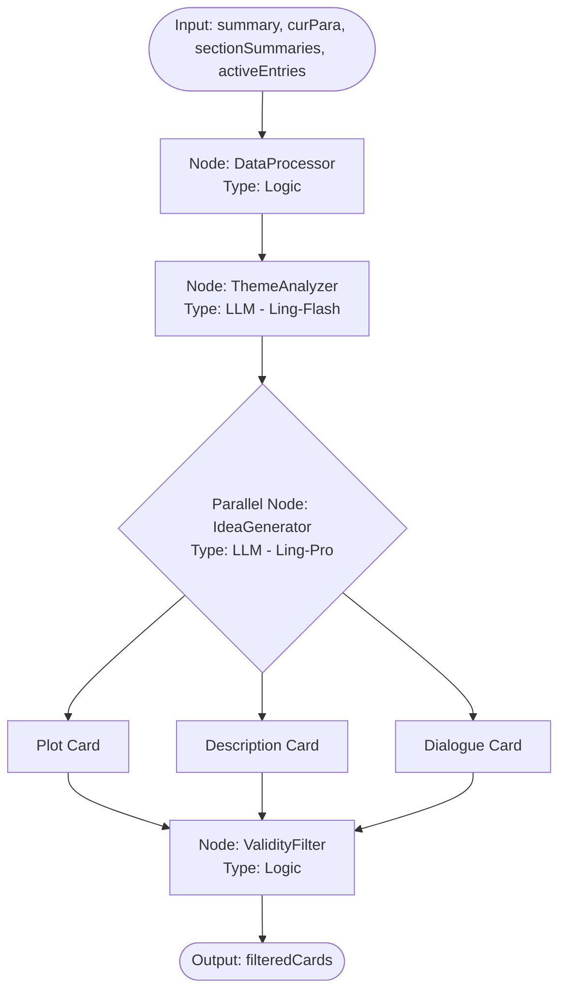
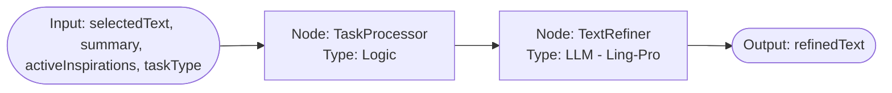

# 2026-02-14-21-30-架构设计-ModelWrite智能体流程与模型选型

## 1. 背景 (Background)

Model Write 的 UI 架构已定型，包含左侧设定集、中间写作画布和右侧灵感/工具区。为了驱动这些界面元素，我们需要定义底层的智能体架构。本文档旨在规范数据结构（区分原始数据与衍生状态），并为每个交互点设计独立的 LangGraph 流程、Mermaid 图示及模型选型策略。

## 2. 核心数据结构 (Core Schema)

### 2.1 原始数据 (Source Data)
这些数据是持久化的真相来源，直接决定 UI 的呈现。

```typescript
interface WriteSessionState {
  metadata: {
    title: string;
    summary: string;
  };
  document: {
    // 正文由离散片段组成，支持预处理状态管理
    segments: TextSegment[];
    cursorOffset: number;
    selection: { start: number; end: number } | null;
    activeSegmentId: string | null;
  };
  knowledgeBase: {
    worldSettings: KnowledgeEntry[];
    characters: KnowledgeEntry[];
    concepts: KnowledgeEntry[];
  };
  runtime: {
    activeInspirationIds: string[];
    ghostText: string | null;
    isGenerating: boolean;
  };
}

interface TextSegment {
  id: string;
  content: string;
  // 预处理状态：raw(未处理) | processing(处理中) | completed(已完成)
  status: 'raw' | 'processing' | 'completed';
  // 预处理产物：存储单句摘要和提取的实体名
  preprocessed: {
    summary: string | null;
    extractedEntities: string[];
  } | null;
}
```

### 2.2 衍生状态 (Derived Context)
触发 LLM 流程时动态计算的上下文。

```typescript
interface DerivedWriteContext {
  semantics: {
    lastParagraph: string;
    currentParagraph: string;
    nextParagraph: string; // 光标后的内容
    currentSentencePrefix: string; // 光标前的当前句片段
    historySummaries: string; // 压缩后的历史摘要
  };
  matchedKnowledge: KnowledgeEntry[]; // 基于当前上下文匹配的知识条目
  activeInspirations: InspirationCard[];
}
```

## 3. LangGraph 流程设计

### 3.0 SegmentPreprocessor (片段预处理器) - [新增核心机制]
**目标**: 将长段落压缩为单句摘要并提取实体，为后续创作提供结构化背景。
**触发**: 
- 停止输入一段时间 (Debounce 2s)。
- 光标离开当前片段。
- **失效机制**: 当片段内容被编辑时，状态重置为 `raw`。


- **输入**: 1. `segmentContent` (片段文本), 2. `storySummary` (故事大纲)。
- **节点流程**: 
    1. **DataValidator**: 检查文本长度及变更。
    2. **Precompute**: 并行生成单句摘要和提取实体名。
    3. **StateUpdater**: 更新片段状态为 `completed` 并存储产物。
- **模型**: **Ling-Flash** (追求极致吞吐与反馈速度)。

### 3.1 PhantomWeaver (幻影编织者)
**目标**: 极致响应速度的行内补全 (Ghost Text)。


- **输入**: `Summary`, `当前段`, `后续段`, `当前句子(光标前)`, `启用灵感内容`, `匹配到的Knowledge内容`。
- **节点流程**:
    1. **DataProcessor**: 收集上下文并处理。
    2. **Predictor**: 极速推理后续文本。
    3. **ValidityFilter**: 如果内容不合理则进行裁剪或过滤。
- **模型**: **Ling-Flash**。

---

### 3.2 NarrativeFlow (叙事流)
**目标**: 高质量段落续写 (Continue)。


- **输入**: `Summary`, `当前段`, `所有手动Knowledge`, `启用灵感内容`, `历史段落摘要`。
- **节点流程**:
    1. **DataProcessor**: 数据收集。
    2. **ContextCompressor**: 压缩历史摘要。
    3. **NarrativeWriter**: 核心叙事续写。
    4. **PostProcessor**: 有效性过滤与格式修正。
- **模型**: **Ling-Pro** (写入), **Ling-Flash** (压缩)。

---

### 3.3 LoreKeeper (知识守夜人)
**目标**: 自动实体提取、设定维护及建议生成。


- **输入**: `Summary`, `未经处理的段落(新概念)`, `手动Knowledge`, `推断Knowledge`, `历史段落摘要`。
- **节点流程**:
    1. **DataProcessor**: 数据准备。
    2. **NameExtractor**: 提取实体名称。
    3. **DefinitionGenerator**: 提取实体定义。
    4. **TraitSuggestor**: 生成特征建议碎片（加入随机走向，提供后续设定可能性）。
    5. **Filter&Deduplicator**: 过滤并与现有实体去重。
- **模型**: **Ling-Ultra/Pro**。

---

### 3.4 MuseWhisper (缪斯低语)
**目标**: 动态生成创意灵感卡片。


- **输入**: `Summary`, `当前段`, `历史段落摘要`, `当前启用Knowledge`。
- **节点流程**:
    1. **DataProcessor**: 数据整合。
    2. **ThemeAnalyzer**: 判定当前风格与张力。
    3. **IdeaGenerator**: 并行生成不同类型的创意卡片。
    4. **ValidityFilter**: 过滤重复或低质建议。
- **模型**: **Ling-Pro**。

---

### 3.5 ContentRewriter (改写者) & ContentExpander (扩写者)
**目标**: 针对选中内容的局部改写与扩充。


- **输入**: `选中内容`, `Summary`, `启用的灵感内容`, `任务类型(Rewrite/Expand)`。
- **模型**: **Ling-Pro**。

---

## 4. 模型选型总结 (Model Selection)

| Agent | 模型层级 | 关键指标 | 延迟要求 |
| :--- | :--- | :--- | :--- |
| **PhantomWeaver** | Ling-Flash | 推理延迟 | < 500ms |
| **NarrativeFlow** | Ling-Pro | 指令遵循、文学表现力 | < 3000ms (Start) |
| **LoreKeeper** | Ling-Ultra | 准确率、逻辑一致性 | N/A (Background) |
| **MuseWhisper** | Ling-Pro | 发散性、创意度 | < 2000ms |
| **Rewriter/Expander**| Ling-Pro | 精准改写、风格保持 | < 2000ms |

## 5. UI 视觉表现规范 (Preprocessing UI)

为了实现类似“Word 审阅模式”的专业协作体验，编辑器采用双栏布局：

- **双栏结构 (Two-Column Layout)**:
    - **左侧 (Canvas)**: 主写作区，占宽约 70%。
    - **右侧 (Insight Margin)**: 专用的预处理概要栏。
- **片段状态渲染**:
    - `raw`: 黑色文字，代表正在创作的活跃状态。
    - `processing`: 琥珀黄文字，代表正在进行异步计算。
    - `completed`: 深靛蓝文字，代表已建立结构化索引。
- **预处理概要 (Segment Insights)**:
    - 与段落垂直对齐，在右侧 Margin 中展示。
    - **Summary**: 位于上方，使用 `text-[11px] font-medium leading-snug text-brand-dark/40`。
    - **Entity Pills**: 位于摘要下方，展示为微型药丸标签 (`Badge`)。
    - **样式**: `bg-indigo-50/50 text-indigo-900/40 border-indigo-100/30`。
- **交互感**:
    - 概要信息在 `completed` 状态下常驻显示，但在非活跃状态下保持低透明度，仅在悬浮或点击段落时高亮，确保不干扰创作。
