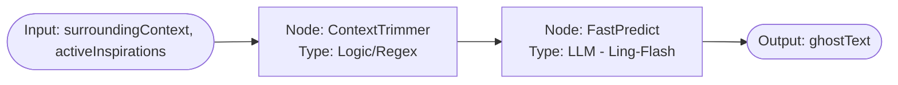
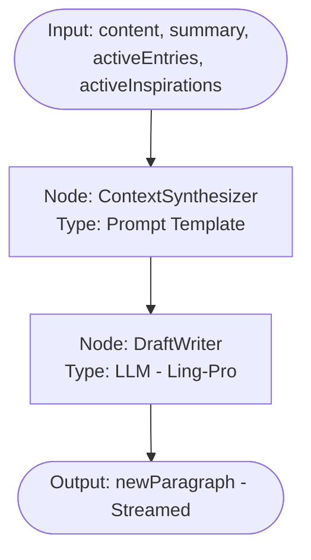
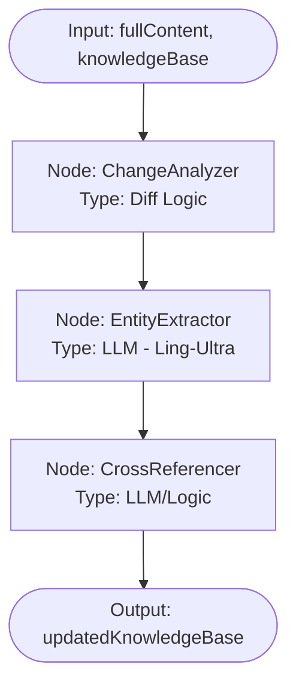
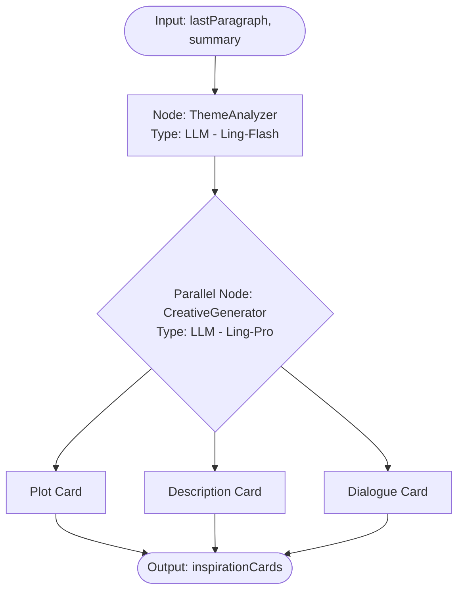
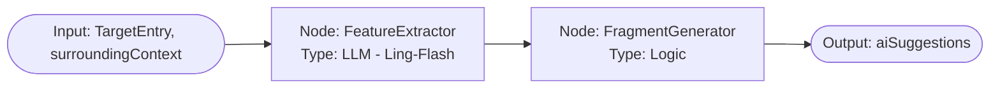

# 2026-02-14-21-30-架构设计-ModelWrite智能体流程与模型选型

## 1. 背景 (Background)

Model Write 的 UI 架构已定型，包含左侧设定集、中间写作画布和右侧灵感/工具区。为了驱动这些界面元素，我们需要定义底层的智能体架构。本文档旨在规范数据结构（区分原始数据与衍生状态），并为每个交互点设计独立的 LangGraph 流程、Mermaid 图示及模型选型策略。

## 2. 核心数据结构 (Core Schema)

### 2.1 原始数据 (Source Data)
这些数据是持久化的真相来源，直接决定 UI 的呈现。

```typescript
interface WriteSessionState {
  metadata: {
    title: string;
    summary: string;
  };
  document: {
    content: string;
    cursorOffset: number;
    selection: { start: number; end: number } | null;
  };
  knowledgeBase: {
    worldSettings: KnowledgeEntry[];
    characters: KnowledgeEntry[];
    concepts: KnowledgeEntry[];
  };
  runtime: {
    activeInspirationIds: string[];
    ghostText: string | null;
    isGenerating: boolean;
  };
}
```

### 2.2 衍生状态 (Derived Context)
触发 LLM 流程时动态计算的上下文。

```typescript
interface DerivedWriteContext {
  semantics: {
    lastSentence: string;
    lastParagraph: string;
    currentSentence: string;
    currentParagraph: string;
    surroundingContext: string;
  };
  activeEntries: KnowledgeEntry[];
  activeInspirations: InspirationCard[];
}
```

## 3. LangGraph 流程设计

### 4.1 PhantomWeaver (幻影编织者)
**目标**: 极致响应速度的行内补全。


- **输入**: `DerivedContext.semantics.surroundingContext`, `DerivedContext.activeInspirations` (取标题)。
- **输出**: `ghostText: string` (推荐补全的后续文本)。

🟥 输入改成 1.summary， 2. 当前段， 3. 后续段， 4. 当前句子（光标之前） 5.启用的灵感卡片内容； 6. 前述部分匹配的 knowledge entry 的相关内容。
🟥 整个流程： 1. 内容收集和处理节点（代码） 2. 推理节点（llm） 3. 有效性过滤节点，如果内容明显不合理则裁剪短（代码）

---


### 4.2 NarrativeFlow (叙事流)
**目标**: 高质量段落续写。


- **输入**: `SourceData.document.content`, `SourceData.metadata.summary`, `DerivedContext.activeEntries`, `DerivedContext.activeInspirations` (对象全量内容)。
- **输出**: `ReadableStream` (流式返回的新段落内容)。

🟥 输入：1. summary 2. 当前段落内容 3. 所有用户手动的knowledge entry 4. 启用的灵感卡片内容 5. 前面部分的每段摘要
🟥 整个流程： 1. 内容收集和处理（代码） 2. 压缩前述部分摘要（LLM） 3. 推理续写（LLM） 4. 有效性过滤（代码）

---


### 4.3 LoreKeeper (知识守夜人)
**目标**: 全文实体提取与设定维护。


- **输入**: `SourceData.document.content` (全量), `SourceData.knowledgeBase` (存量去重)。
- **输出**: `KnowledgeEntry[]` (新增或更新的自动化提取条目)。

🟥 输入：1. summary, 2. 「未经处理的段落（新概念）」内容，3. 当前手动的knowledge entry 4.当前推断的knowledge entry 5. 前面部分的每段摘要
🟥 整个流程： 1. 内容收集和处理（代码）2. 实体名称提取（LLM） 3. 实体定义提取（LLM） 4. 过滤和现有实体去重（代码）

---


### 4.4 MuseWhisper (缪斯低语)
**目标**: 动态生成创意灵感卡片。


- **输入**: `DerivedContext.semantics.lastParagraph`, `SourceData.metadata.summary`。
- **输出**: `InspirationCard[]` (包含类型、标题、内容的卡片列表)。

🟥输入： 1. summary 2. 当前段落内容 3. 前面部分的每段摘要，4. 当前启用的knowledge entry
🟥整个流程： 1. 内容收集和处理（代码） 2. 主题分析（LLM） 3. 创意生成（LLM，分支生成不同类型的卡片） 4. 有效性过滤（代码）

---


### 4.5 DetailSculptor (细节雕刻师)
**目标**: 辅助完善设定集条目。


- **输入**: `KnowledgeEntry` (当前编辑对象), `DerivedContext.semantics.surroundingContext` (语义关联片段)。
- **输出**: `string[]` (描述特征碎片列表)。

🟥这个不用单独一条流程，直接整合在 LoreKeeper 里。生成的时候加入一些随机走向，提供一系列可能的后续设定。


-------

🟥还少写了两个流程：1. 已选中部分rewriter, 2. 已选中内容 expander


## 4. 模型选型总结 (Model Selection)

| Agent | 模型层级 | 核心指标 | 延迟要求 |
| :--- | :--- | :--- | :--- |
| **PhantomWeaver** | Ling-Flash | 推理延迟 | < 500ms |
| **NarrativeFlow** | Ling-Pro | 指令遵循、创意文学性 | < 3000ms (Start) |
| **LoreKeeper** | Ling-Ultra | 上下文窗口、准确率 | N/A (Background) |
| **MuseWhisper** | Ling-Pro | 逻辑发散、情感分析 | < 2000ms |
| **DetailSculptor** | Ling-Flash | 提取速度 | < 1000ms |


