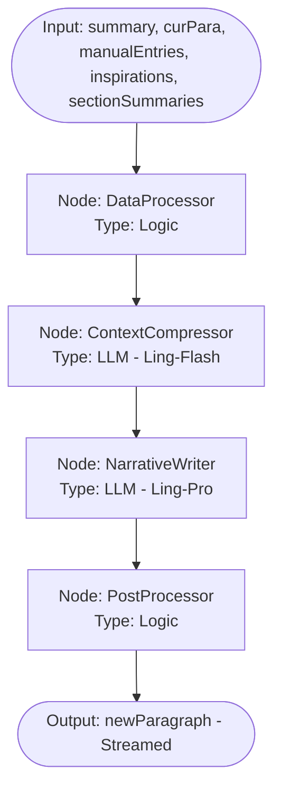

# 2026-02-14-21-30-架构设计-ModelWrite智能体流程与模型选型

## 1. 背景 (Background)

Model Write 的 UI 架构已定型，包含左侧设定集、中间写作画布和右侧灵感/工具区。为了驱动这些界面元素，我们需要定义底层的智能体架构。本文档旨在规范数据结构（区分原始数据与衍生状态），并为每个交互点设计独立的 LangGraph 流程、Mermaid 图示及模型选型策略。

## 2. 核心数据结构 (Core Schema)

### 2.1 原始数据 (Source Data)
这些数据是持久化的真相来源，直接决定 UI 的呈现。

```typescript
interface WriteSessionState {
  metadata: {
    title: string;
    summary: string;
  };
  document: {
    content: string; // 完整的文本内容
    sectionSummaries: string[]; // 历史段落/章节的摘要列表
    cursorOffset: number;
    selection: { start: number; end: number } | null;
  };
  knowledgeBase: {
    worldSettings: KnowledgeEntry[];
    characters: KnowledgeEntry[];
    concepts: KnowledgeEntry[];
  };
  runtime: {
    activeInspirationIds: string[];
    ghostText: string | null;
    isGenerating: boolean;
  };
}
```

### 2.2 衍生状态 (Derived Context)
触发 LLM 流程时动态计算的上下文。

```typescript
interface DerivedWriteContext {
  semantics: {
    lastParagraph: string;
    currentParagraph: string;
    nextParagraph: string; // 光标后的内容
    currentSentencePrefix: string; // 光标前的当前句片段
    historySummaries: string; // 压缩后的历史摘要
  };
  matchedKnowledge: KnowledgeEntry[]; // 基于当前上下文匹配的知识条目
  activeInspirations: InspirationCard[];
}
```

## 3. LangGraph 流程设计

### 3.1 PhantomWeaver (幻影编织者)
**目标**: 极致响应速度的行内补全 (Ghost Text)。


- **输入**: `Summary`, `当前段`, `后续段`, `当前句子(光标前)`, `启用灵感内容`, `匹配到的Knowledge内容`。
- **节点流程**:
    1. **DataProcessor**: 收集上下文并处理。
    2. **Predictor**: 极速推理后续文本。
    3. **ValidityFilter**: 如果内容不合理则进行裁剪或过滤。
- **模型**: **Ling-Flash**。

---

### 3.2 NarrativeFlow (叙事流)
**目标**: 高质量段落续写 (Continue)。


- **输入**: `Summary`, `当前段`, `所有手动Knowledge`, `启用灵感内容`, `历史段落摘要`。
- **节点流程**:
    1. **DataProcessor**: 数据收集。
    2. **ContextCompressor**: 压缩历史摘要。
    3. **NarrativeWriter**: 核心叙事续写。
    4. **PostProcessor**: 有效性过滤与格式修正。
- **模型**: **Ling-Pro** (写入), **Ling-Flash** (压缩)。

---

### 3.3 LoreKeeper (知识守夜人)
**目标**: 自动实体提取、设定维护及建议生成。


- **输入**: `Summary`, `未经处理的段落(新概念)`, `手动Knowledge`, `推断Knowledge`, `历史段落摘要`。
- **节点流程**:
    1. **DataProcessor**: 数据准备。
    2. **NameExtractor**: 提取实体名称。
    3. **DefinitionGenerator**: 提取实体定义。
    4. **TraitSuggestor**: 生成特征建议碎片（加入随机走向，提供后续设定可能性）。
    5. **Filter&Deduplicator**: 过滤并与现有实体去重。
- **模型**: **Ling-Ultra/Pro**。

---

### 3.4 MuseWhisper (缪斯低语)
**目标**: 动态生成创意灵感卡片。


- **输入**: `Summary`, `当前段`, `历史段落摘要`, `当前启用Knowledge`。
- **节点流程**:
    1. **DataProcessor**: 数据整合。
    2. **ThemeAnalyzer**: 判定当前风格与张力。
    3. **IdeaGenerator**: 并行生成不同类型的创意卡片。
    4. **ValidityFilter**: 过滤重复或低质建议。
- **模型**: **Ling-Pro**。

---

### 3.5 ContentRewriter (改写者) & ContentExpander (扩写者)
**目标**: 针对选中内容的局部改写与扩充。


- **输入**: `选中内容`, `Summary`, `启用的灵感内容`, `任务类型(Rewrite/Expand)`。
- **模型**: **Ling-Pro**。

---

## 4. 模型选型总结 (Model Selection)

| Agent | 模型层级 | 关键指标 | 延迟要求 |
| :--- | :--- | :--- | :--- |
| **PhantomWeaver** | Ling-Flash | 推理延迟 | < 500ms |
| **NarrativeFlow** | Ling-Pro | 指令遵循、文学表现力 | < 3000ms (Start) |
| **LoreKeeper** | Ling-Ultra | 准确率、逻辑一致性 | N/A (Background) |
| **MuseWhisper** | Ling-Pro | 发散性、创意度 | < 2000ms |
| **Rewriter/Expander**| Ling-Pro | 精准改写、风格保持 | < 2000ms |
