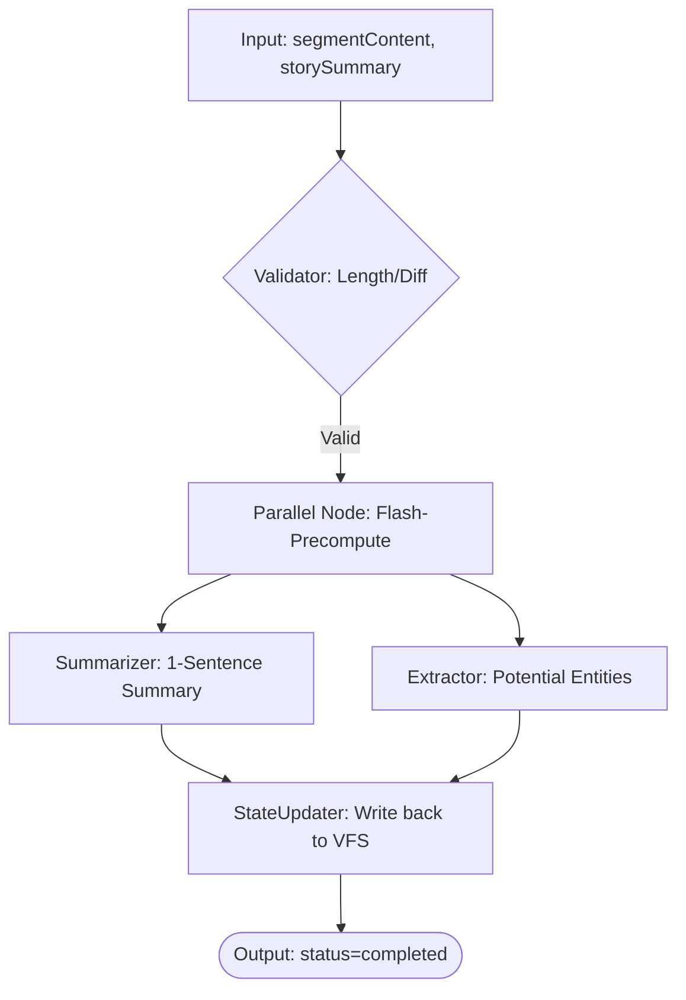
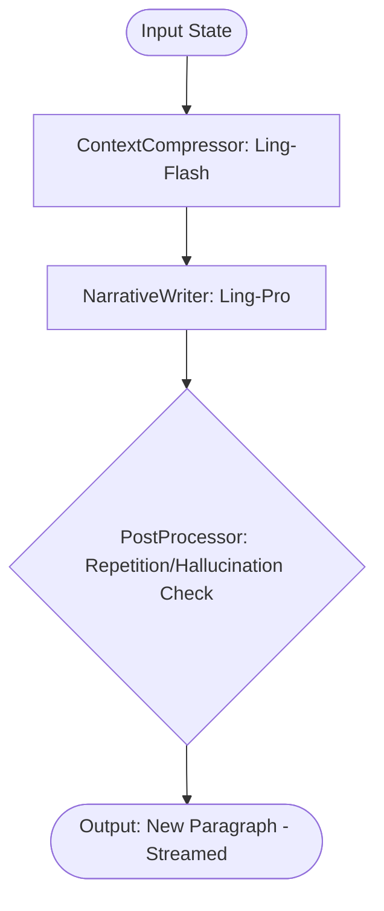
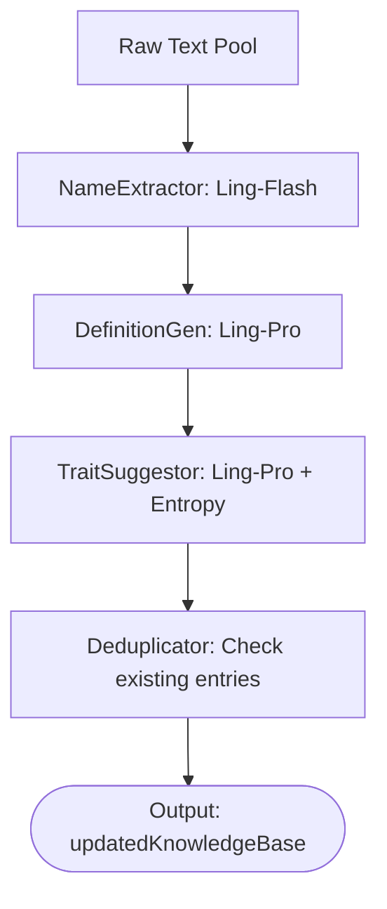

# 2026-02-22-22-12-设计-ModelWrite智能体架构与Graph流程全量梳理

## 1. 智能体概览 (Agent Registry)

| Agent | 模型 | 触发源 | 核心目标 |
| :--- | :--- | :--- | :--- |
| **SegmentPreprocessor** | Ling-Flash | 停顿 2s / 切段 | 段落语义压缩与实体粗筛 |
| **PhantomWeaver** | Ling-Flash | 停顿 500ms | 毫秒级行内续写 (Ghost Text) |
| **NarrativeFlow** | Ling-Pro | Continue 按钮 | 高质量剧情续写 (Streamed) |
| **LoreKeeper** | Ling-Ultra | 背景异步 | 知识库自动维护与建议生成 |
| **MuseWhisper** | Ling-Pro | 手动/阶段性 | 创意灵感卡片分发 |
| **ContentRewriter** | Ling-Pro | 选中触发 | 局部改写、扩写、风格润色 |

## 2. 核心 Graph 流程图解

### 2.1 SegmentPreprocessor (预处理器)
它是整个系统的底层动力，负责将非结构化文本转化为结构化背景。

### 2.2 NarrativeFlow (叙事流)
负责“Continue”功能，追求最高文学表现力。

*   **注**: 必须合并 `activeInspirations` 与 `matchedKnowledge` 到 System Prompt。

### 2.3 LoreKeeper (知识守夜人)
在后台静默运行，遵循“作者主权”原则。

*   **TraitSuggestor**: 专门负责生成那些“具有随机性”的建议碎片，引导用户进行设定补完。

## 3. API 交互矩阵

| API 端点 | 触发 Agent | 请求 Body 关键字段 | 响应处理 |
| :--- | :--- | :--- | :--- |
| `/api/chat/write/precompute` | Preprocessor | `segmentId`, `content` | 前端更新 segments array |
| `/api/chat/write/predict` | Weaver | `prefix`, `context` | 更新 `runtime.ghostText` |
| `/api/chat/write/generate` | Flow | `history`, `lore`, `inspiration` | 流式回填编辑器内核 |
| `/api/chat/write/analyze` | Keeper | `newText`, `existingKB` | 增量更新 `knowledgeBase` |

## 4. 模型选型逻辑
*   **Ling-Flash**: 用于所有“即时反馈”和“大批量背景压缩”任务。追求单向延迟 < 500ms。
*   **Ling-Pro**: 用于“核心文学创作”和“创意建议”。追求极高的文学审美与指令遵循。
*   **Ling-Ultra**: 用于“逻辑一致性维护”。当作品字数超过 10 万字时，由 Ultra 负责全局大纲与细部设定的对齐检查。
