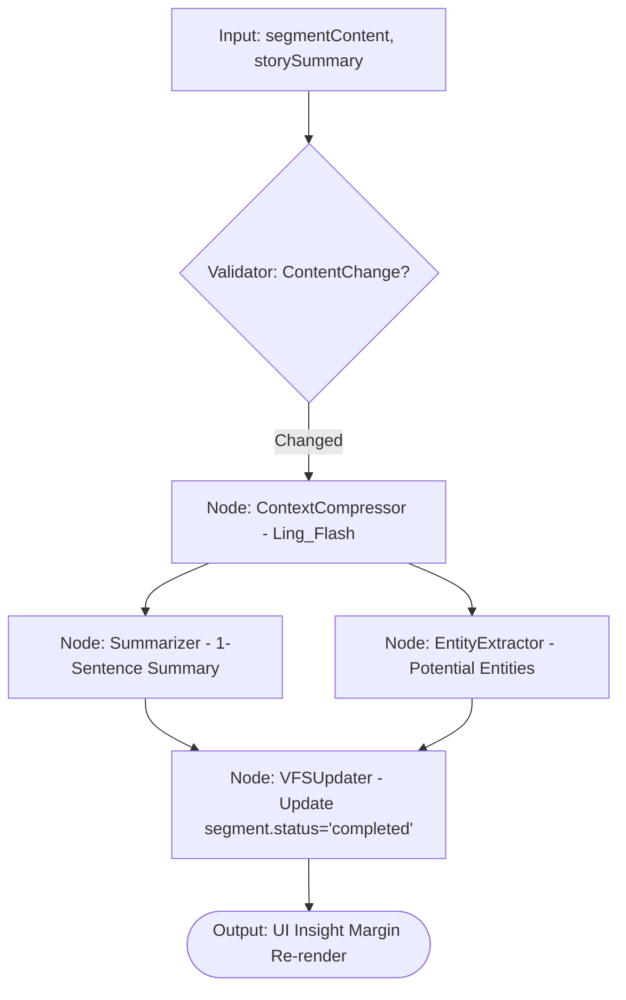
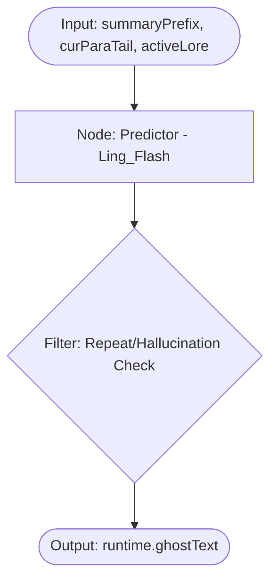
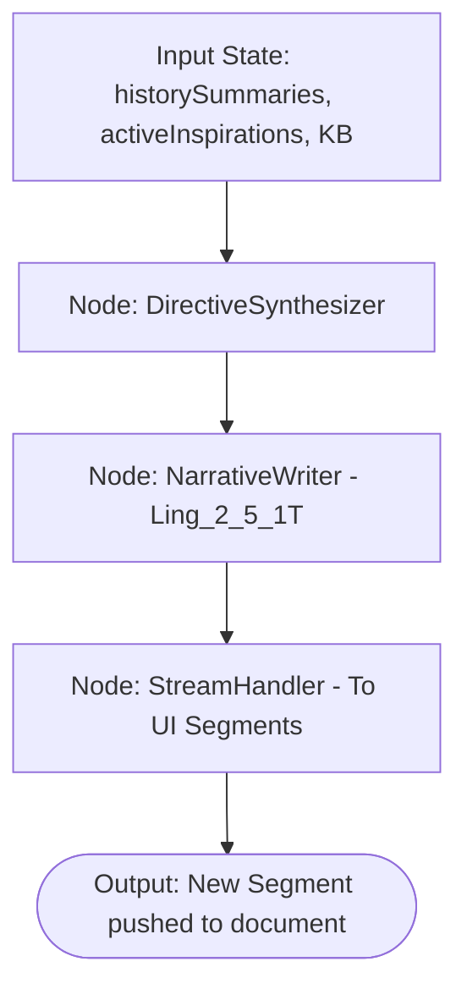
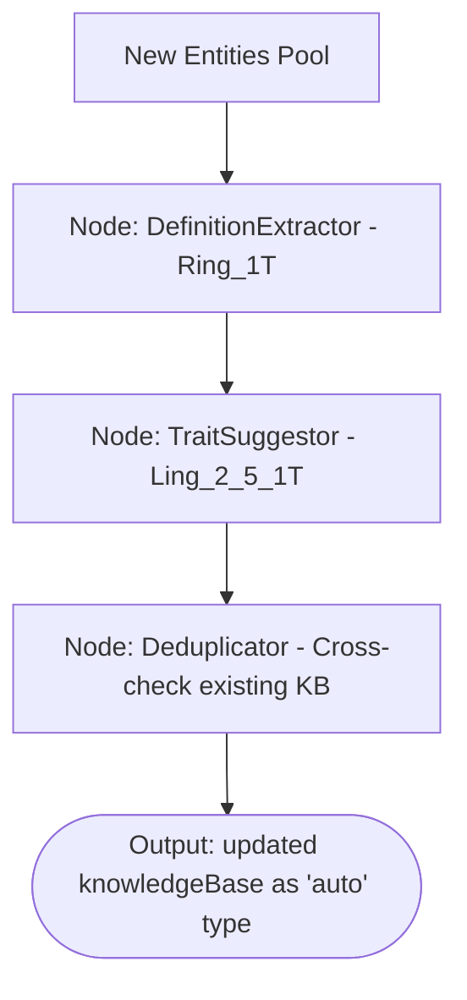

# 2026-02-22-22-12-设计-ModelWrite智能体架构与Graph流程全量梳理

## 1. 核心智能体概览 (Reasoning Graphs)
**代码引用**: `src/components/assistants/write-architect-ref/write-status-viewer.tsx` 中的 `graphs` 列表。

| Agent 名称 | 内部代号 | 模型选型 (Ref: `lib/model.ts`) | 触发源 (UI Trigger) | 核心目标 |
| :--- | :--- | :--- | :--- | :--- |
| **片段预处理器** | `SegmentPreprocessor`| `Ling_Flash` | 停顿 2s / 光标切段 | 将 `raw` 段落压缩为 `summary` 并提取 `entities` |
| **幻影编织者** | `PhantomWeaver` | `Ling_Flash` | 停顿 500ms (Debounced) | 毫秒级行内续写预测 (`ghostText`) |
| **叙事流** | `NarrativeFlow` | `Ling_2_5_1T` | 点击 "Continue Writing" | 消费 `activeInspirations` 生成高质量新段落 |
| **知识守夜人** | `LoreKeeper` | `Ring_1T` | `Completed` 段落生成后 | 增量维护 `knowledgeBase` 及其建议碎片 |
| **缪斯低语** | `MuseWhisper` | `Ling_2_5_1T` | 手动刷新 / 章节转场 | 分发 Plot/Description/Dialogue 灵感卡片 |
| **改写与扩写** | `ContentRewriter` | `Ling_2_5_1T` | 选中文字后点击按钮 | 针对选中区按任务类型(重写/扩写)重构文本 |

## 2. 核心 Graph 流程深度定义

### 2.1 SegmentPreprocessor (片段预处理器)
**目标**: 异步计算 `Insight Margin` 所需的概要信息。
**触发源**: `WriteCanvas` 监听段落失去焦点或输入停止。

*   **模型逻辑**: 使用 `Ling_Flash` 以确保在用户切段时，侧边栏概要能近乎实时地“闪现”出来。

### 2.2 PhantomWeaver (幻影编织者)
**目标**: 实现极致响应的 `Ghost Text`。
**触发源**: `WriteCanvas` 光标后实时预测。

*   **模型逻辑**: 必须使用 `Ling_Flash`。该任务对延迟极其敏感（目标 < 500ms），宁可牺牲部分文采也要保证响应速度。

### 2.3 NarrativeFlow (叙事流)
**目标**: 响应 `Continue Writing` 按钮，进行长文本流式生成。
**触发源**: `WriteRightSidebar` 中的 `Continue` 按钮。

*   **模型逻辑**: 使用 `Ling_2_5_1T`（旗舰级）。续写需要极高的文学表现力和逻辑一致性，且必须精准执行“灵感卡片”中的创意指令。

### 2.4 LoreKeeper (知识守夜人)
**目标**: 维护 `Knowledge Base` 及其“二段式转正”交互中的建议。
**触发源**: 在后台静默执行，监听 `SegmentPreprocessor` 的完成事件。

*   **模型逻辑**: 
    *   提取定义使用 `Ring_1T`（平衡性能与逻辑）。
    *   生成建议碎片使用 `Ling_2_5_1T`，以提供更具启发性和创意性的设定引导。

## 3. API 交互规范 (API Mapping)

| Endpoint | 触发组件 | 数据载荷 (Payload) | 前端回调处理 |
| :--- | :--- | :--- | :--- |
| `/api/chat/write/precompute` | `WriteCanvas` | `{ segmentId, content }` | 设置 `status='processing'` -> `completed` |
| `/api/chat/write/predict` | `WriteCanvas` | `{ prefixContext, activeLores }` | 更新 `runtime.ghostText` 占位文本 |
| `/api/chat/write/generate` | `WriteRightSidebar` | `{ history, inspirations }` | 向 `segments` 数组流式追加新 `Segment` |
| `/api/chat/write/analyze` | `WriteStatusViewer` | `{ fullText }` | 刷新 `knowledgeBase` 中的 `auto` 条目 |

## 4. 模型选型逻辑 (Selection Strategy)

*   **Ling_Flash (极速响应)**: 驱动 `PhantomWeaver` 和 `SegmentPreprocessor`。目标：单次生成首字延迟 < 300ms。
*   **Ling_2_5_1T (旗舰创意)**: 驱动 `NarrativeFlow` 和 `MuseWhisper`。目标：提供具备文学美感、复杂修辞和深度逻辑的长文本生成。
*   **Ring_1T (高性能逻辑)**: 驱动 `LoreKeeper` 的后台实体提取任务。目标：在不干扰前台输入的前提下，高效完成知识库一致性维护。
